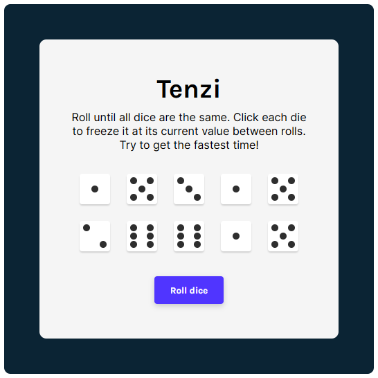

# <div align="center"><center>[Tenzi](https://tenzi-game.vercel.app/)</div>
A game of dice where the goal is to hold ten dice of the same value. Try to get the fastest time!

## 🏃 Motivation & Challenges
This project was created to practice using React and apply what I learned about React Hooks

#### Tracking amount of rolls:
```javascript
const [rollCount, setRollCount] = React.useState(0);

function rollNewDice() {
    // tenzies is another state keeping track of the win condition
    if (!tenzies) {
        setRollCount((prevCount) => prevCount + 1);
    } else {
        setRollCount(0);
    }
}
```

#### Conditionally rendering dot faces with props:
```javascript
// if value is 1, render class with props.value
{value === 1 && (
    <div className={`--${value}`}>
        <span class="dot"></span>
    </div>
)}
```

#### Using localStorage to keep track of best time:
```javascript
React.useEffect(() => {
    const currentBestTime = localStorage.getItem("bestTime");
    if (tenzies) {
        if (!currentBestTime) {
            localStorage.setItem("bestTime", JSON.stringify(time));
        } else if (time < currentBestTime) {
            setBestTime(time);
        }
    }
}, [tenzies, time]);
```

## 🚧 To Do
- [x] Add dots instead of numbers to dice
- [x] Track number of rolls
- [x] Track time to win
- [x] Save best time in localStorage

Preview
---

