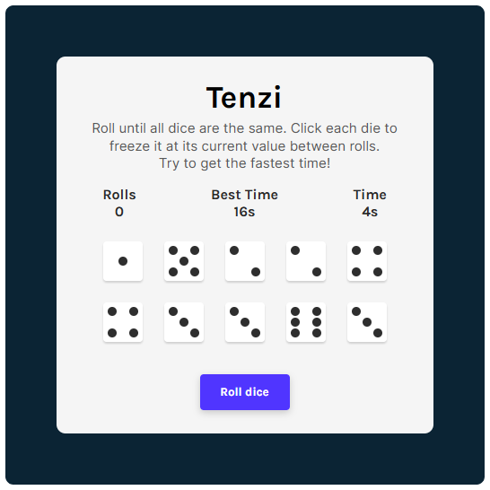

# <div align="center"><center>[Tenzi](https://tenzi-game.vercel.app/)</div>
A game of dice where the goal is to hold ten dice of the same value. Try to get the fastest time!

## 🏃 Motivation & Challenges
This project was created to practice using React and apply what I learned about React Hooks

#### Conditionally rendering dot faces with props:
```javascript
// if value is 1, render class with props.value
{value === 1 && (
	<div className={`--${value}`}>
		<span class="dot"></span>
	</div>
)}
```

## 🚧 To Do
- [x] Add dots instead of numbers to dice
- [ ] Track number of rolls
- [ ] Track time to win
- [ ] Save best time in localStorage

Preview
---

